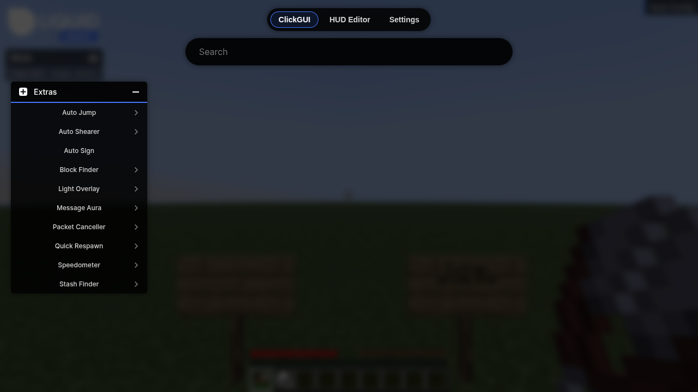
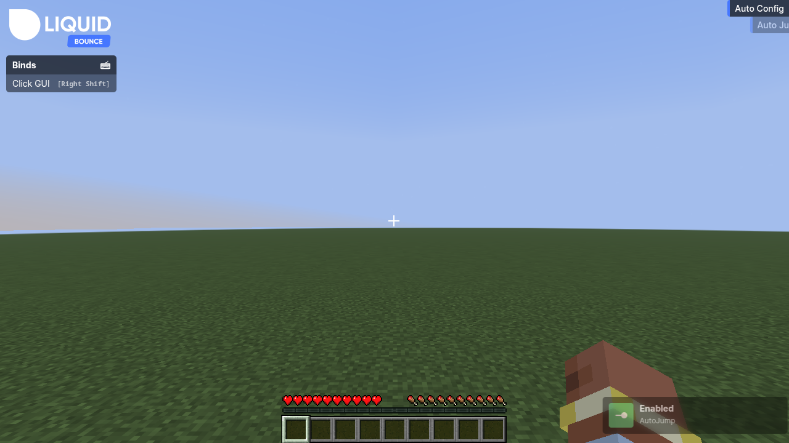
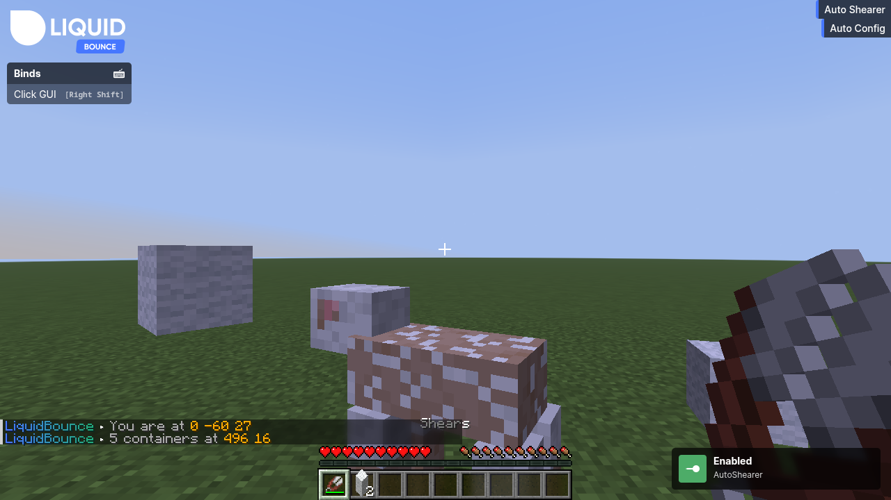
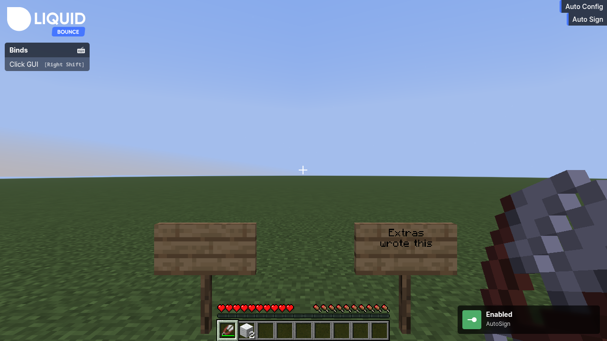
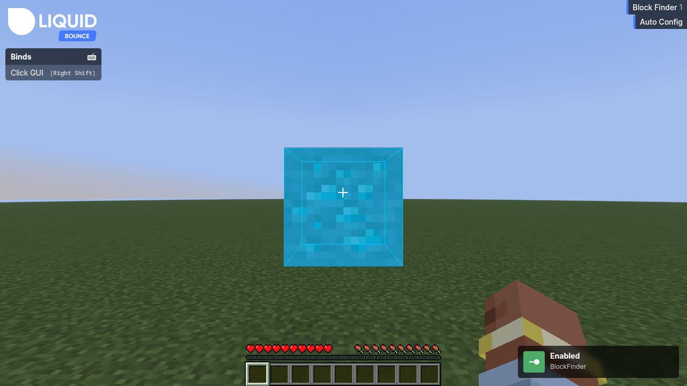
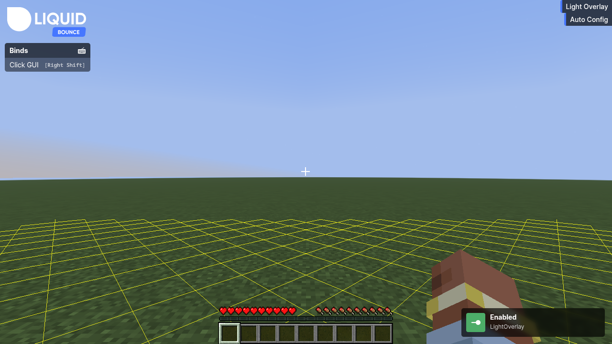
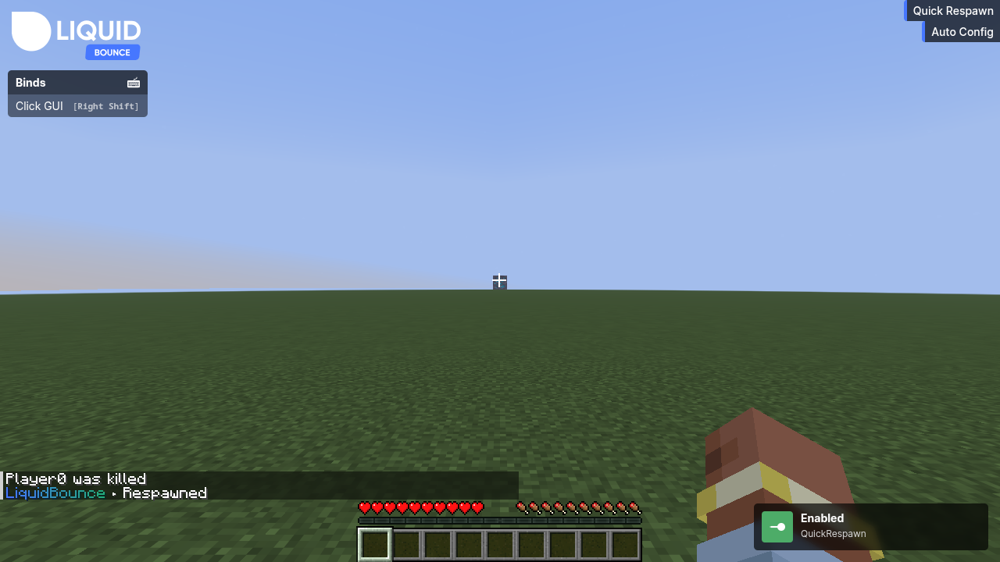
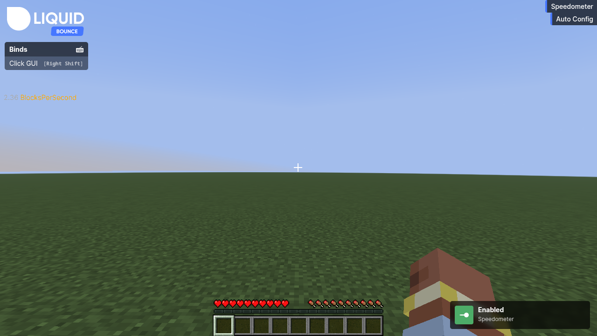
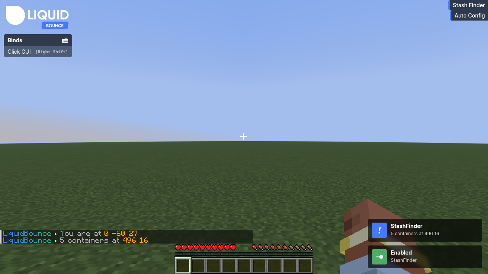
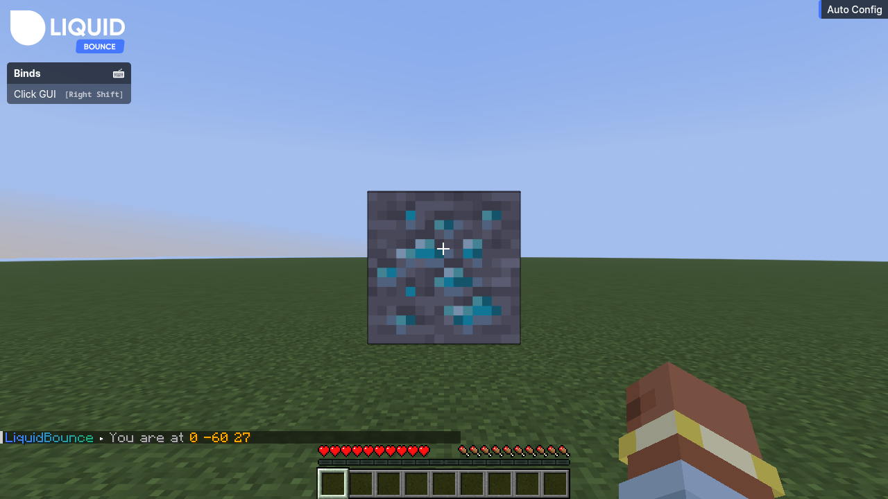

# LiquidBounce Extras

Modules that [LiquidBounce](https://github.com/CCBlueX/LiquidBounce) does not ship. Drop the jar from the
[releases](https://github.com/CCBlueX/LiquidBounce-Addon-Extras/releases) into `mods/` next to the client;
the modules show up in an `Extras` category.



Every module is written against the stable add-on API, half in Kotlin and half in Java, and each one runs
in a client game test that also takes the screenshots below. Start with the
[template](https://github.com/CCBlueX/LiquidBounce-Addon-Template), come here to see how something is done.

## Modules

### AutoJump (Java)

Jumps whenever you are on the ground: always, only while moving, or only while sprinting.



### AutoShearer (Kotlin)

Shears every sheep in reach. Aims through the client's rotation engine, takes the shears without changing
the visible hotbar slot, and interacts once the server-side rotation has arrived.



### AutoSign (Java)

Writes every new sign with the text of the last one you wrote yourself. The sign editor never opens.



### BlockFinder (Kotlin)

Highlights every block of one type around you and puts the count into the module's HUD tag.



### LightOverlay (Kotlin)

Marks blocks where hostile mobs can spawn: red where they spawn right now, yellow where only the daylight
keeps them away.



### MessageAura (Java)

Whispers a message to every player who comes into view, one message per delay window. Friends can be
left alone, and joining a world greets nobody.

### PacketCanceller (Kotlin)

Drops the packets picked in the settings, in either direction, before any other module sees them.

### QuickRespawn (Java)

Respawns a few ticks after you die and says so in chat.



### Speedometer (Java)

Shows your speed on the screen in blocks per tick or per second, plain or in a box.



### StashFinder (Kotlin)

Reports chunks with many containers as they load, in chat and as a notification.



## Commands

`.where` prints your position, `.where share` tells the server chat.



## Building and testing

```sh
./gradlew build
./gradlew runClientGameTest
```

The game test needs a display; CI uses Xvfb. Its screenshots land in `build/run/clientGameTest/screenshots/`.
`-Pgametest.mcef=<path to an existing LiquidBounce/mcef/libraries>` skips the browser download.

## License

This project is subject to the [GNU General Public License v3.0](https://www.gnu.org/licenses/gpl-3.0.en.html). This
does only apply for source code located directly in this clean repository. During the development and compilation
process, additional source code may be used to which we have obtained no rights. Such code is not covered by the GPL
license.

The mob spawn rule in `ModuleLightOverlay` is derived from
[Meteor Client](https://github.com/MeteorDevelopment/meteor-client), Copyright Meteor Development, also GPL-3.0.

For those who are unfamiliar with the license, here is a summary of its main points. This is by no means legal advice
nor legally binding.

*Actions that you are allowed to do:*

- Use
- Share
- Modify

*If you do decide to use ANY code from the source:*

- **You must disclose the source code of your modified work and the source code you took from this project. This means
  you are not allowed to use code from this project (even partially) in a closed-source (or even obfuscated)
  application.**
- **Your modified application must also be licensed under the GPL**
