# LiquidBounce Extras

Modules and HUD components that [LiquidBounce](https://github.com/CCBlueX/LiquidBounce) does not ship. The code is proudly hallucinated by Claude Opus 5.5 and GPT-6 (Astra). In my opinion, for such an add-on, this is fine. I would not recommend making AI write module code for an actual client; however, Claude does kind of well with game testing. Its idea is to write simplistic code to give you an idea of how to write your own add-on.

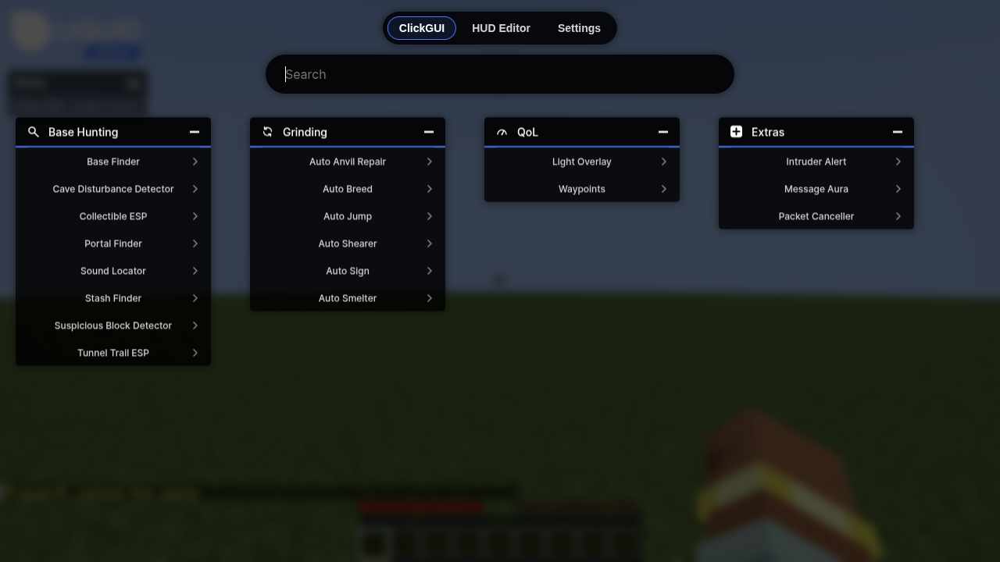

## Modules

### Base Hunting

- **BaseFinder** (Kotlin) reports chunks with blocks only players place, a pile of workstations, placed
  entities such as filled item frames, armor stands and boats, written signs, or villagers that have traded.
- **StashFinder** (Kotlin) reports chunks with many containers as they load. Trial chambers are left out.
- **SuspiciousBlockDetector** (Kotlin) reports doors, trapdoors, chests, ladders, beds, obsidian and metal
  blocks that appear near you once the chunks around you have settled.
- **CollectibleESP** (Kotlin) highlights valuables in item frames, filled maps included, and banners.
- **PortalFinder** (Kotlin) reports and marks lit Nether and End portals.
- **CaveDisturbanceDetector** (Kotlin) marks plain air in cave walls, where someone mined into a cave.
- **TunnelTrailESP** (Kotlin) highlights dug tunnels, staircases and one-wide shafts.
- **SoundLocator** (Kotlin) marks where the server played explosions, containers and portals, or whichever
  sounds you pick.

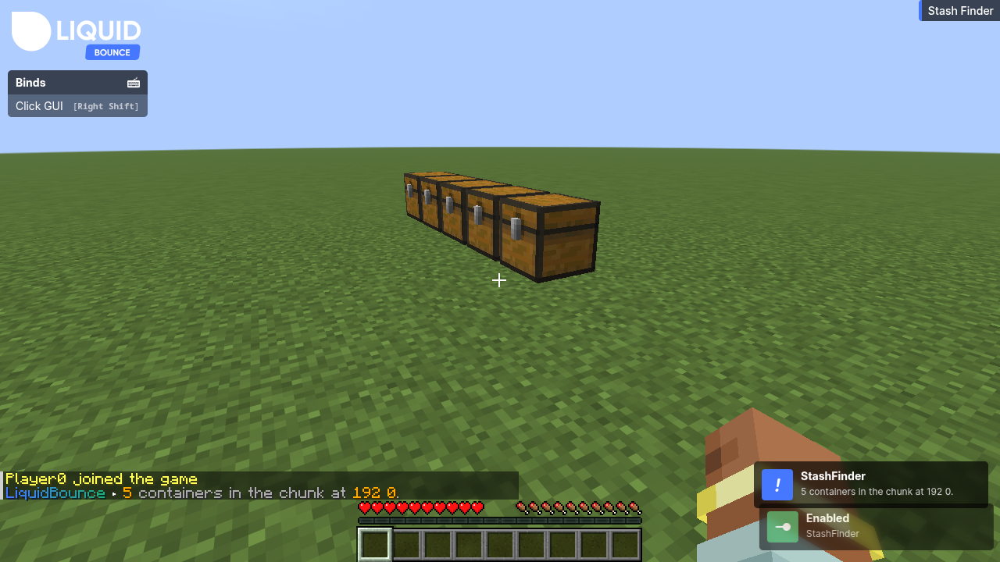
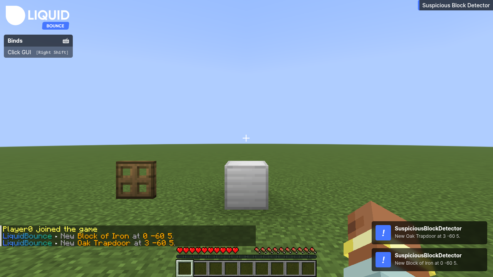

### Grinding

- **AutoJump** (Java) jumps for you: always, while moving, or while sprinting.
- **AutoShearer** (Kotlin) shears sheep in reach, switching to shears without changing your visible slot.
- **AutoSign** (Java) writes every new sign with the text of the last sign you wrote. The editor never opens.
- **AutoAnvilRepair** (Kotlin) combines damaged items of the same kind in an open anvil, up to a level cost.
  Enchanted items are never sacrificed.

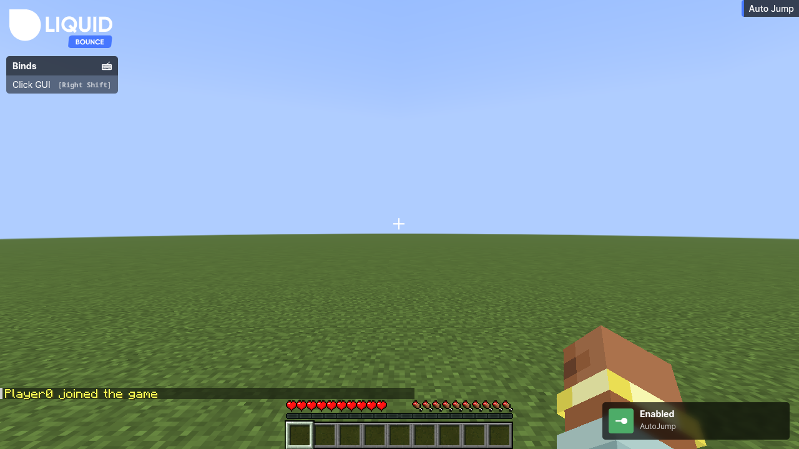
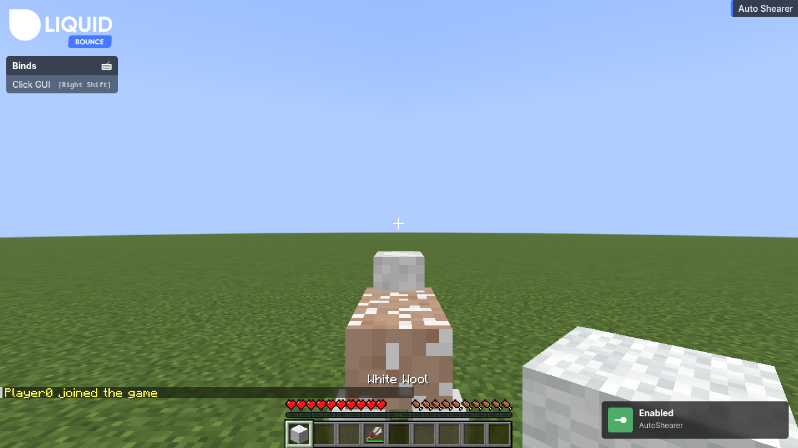
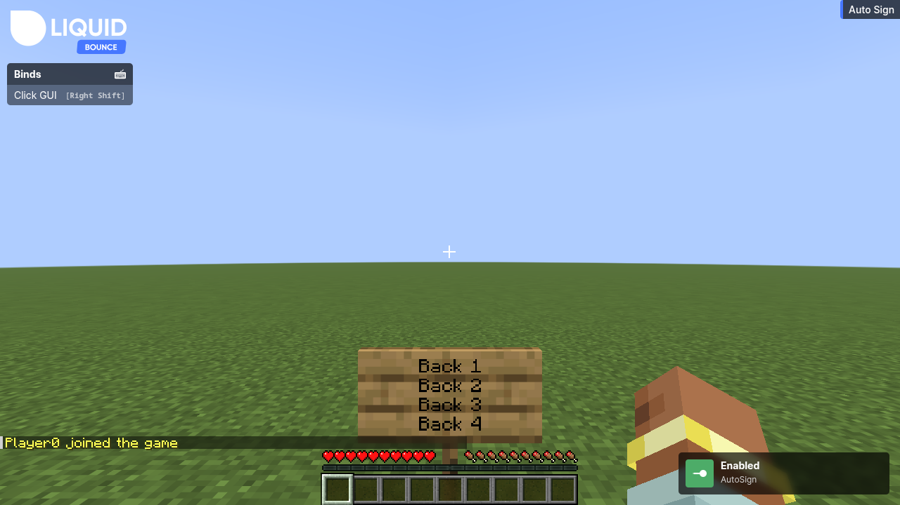
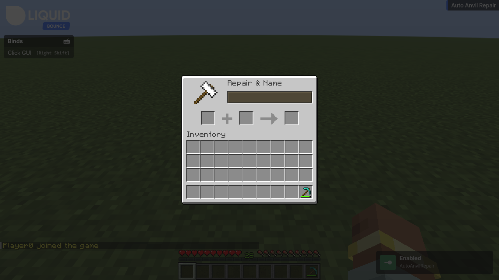

### QoL

- **LightOverlay** (Kotlin) marks where hostile mobs can spawn: red right now, yellow once it is dark.
- **Waypoints** (Kotlin) lists the waypoints of this session with distance and direction.

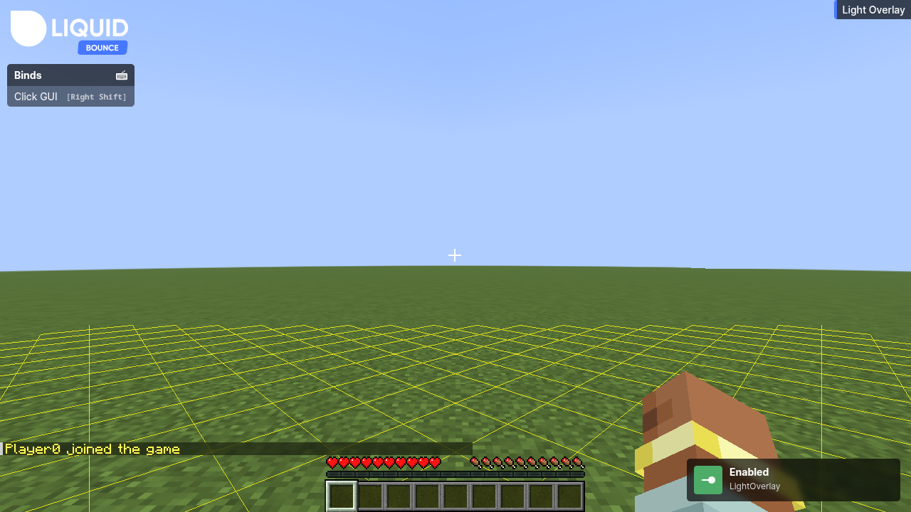
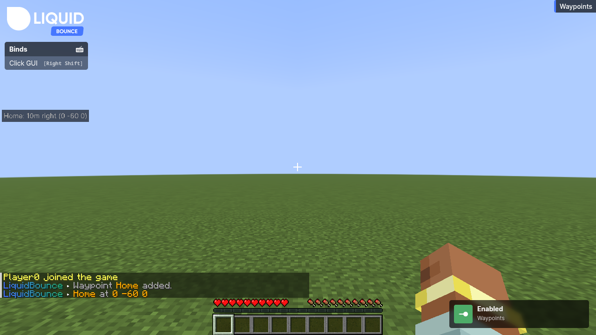

### Extras

- **MessageAura** (Java) whispers a message to every player who comes into view, one per delay.
- **PacketCanceller** (Kotlin) drops the packets you pick, in either direction.
- **IntruderAlert** (Kotlin) reports players who are not your friends as they come near.

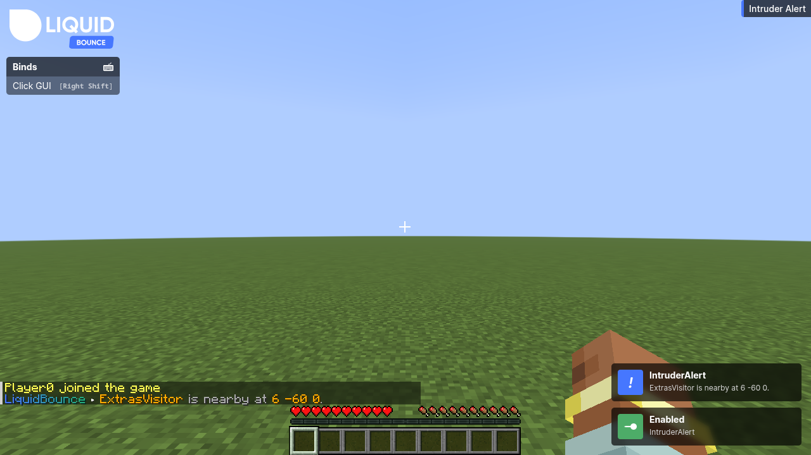

## HUD components

Add **FPS**, **TPS**, **Ping**, **Player**, **CPS**, **Biome**, **Coordinates** or **Speedometer** in the HUD
editor. Each has its own prefix, suffix, colour, shadow, padding and background.

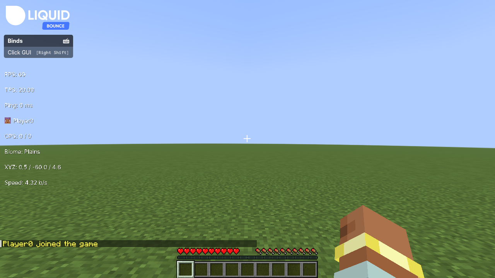

## Commands

`.where` prints your position, `.where share` says it in the server chat. `.waypoint add <name>`,
`.waypoint remove <name>` and `.waypoint list` manage the waypoints.

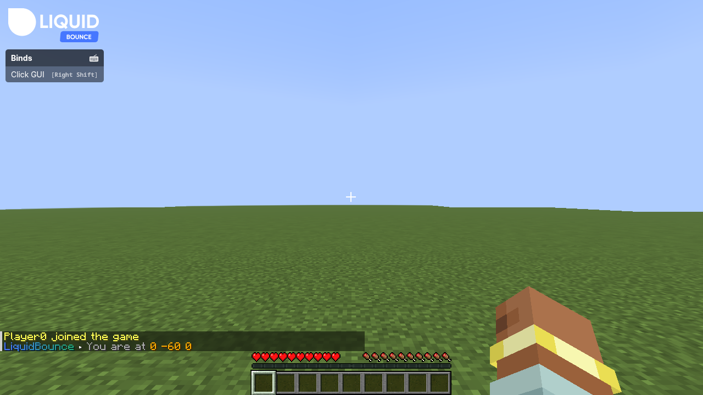

## Building and testing

```sh
./gradlew build
./gradlew runClientGameTest
```

Every game test boots its own Paper 26.3 server with the newest [Grim](https://modrinth.com/plugin/grimac) and
fails when the server objects to anything the client did. [AGENTS.md](AGENTS.md) explains how.

## Commits

`type(scope): subject`, lowercase, no trailing period.

`feat` `fix` `refactor` `chore` `docs`

Scope is the component it lands in: `AutoSign`, `hud`, `gametest`. Drop it when the change spans the
repository. Add a body when the subject alone leaves the next reader guessing.

## Contributing

We appreciate contributions. So if you want to support us, feel free to make changes to LiquidBounce's source code and
submit a pull request.

## Credits

| File | Section | Taken from | Taken as |
|---|---|---|---|
| `modules/qol/ModuleLightOverlay.kt` | Spawn rule | [Meteor Client `BlockUtils`](https://github.com/MeteorDevelopment/meteor-client/blob/79a30a7c9ad459b9cfc1155c598aa58947db7fa5/src/main/java/meteordevelopment/meteorclient/utils/world/BlockUtils.java#L313-L338) | Derived code, GPL-3.0 |
| `modules/basehunting/ModuleStashFinder.kt` | Trial chamber filter | [Meteor Client `StashFinder`](https://github.com/MeteorDevelopment/meteor-client/blob/79a30a7c9ad459b9cfc1155c598aa58947db7fa5/src/main/java/meteordevelopment/meteorclient/systems/modules/world/StashFinder.java#L64-L73) | Idea and block list, GPL-3.0 |
| `modules/basehunting/ModuleCaveDisturbanceDetector.kt` | Plain air next to cave air | [Trouser-Streak `CaveDisturbanceDetector`](https://github.com/etianl/Trouser-Streak/blob/0cf3231b56c25773cd66aa21931470bdf8799c9e/src/main/java/pwn/noobs/trouserstreak/modules/CaveDisturbanceDetector.java) | Idea |
| `modules/basehunting/ModuleBaseFinder.kt` | Written signs and traded villagers | [Trouser-Streak `BaseFinder`](https://github.com/etianl/Trouser-Streak/blob/be39bf88955d91261471a3462af4ef8a5f18b9f4/src/main/java/pwn/noobs/trouserstreak/modules/BaseFinder.java) | Ideas |

## License

This project is subject to the [GNU General Public License v3.0](https://www.gnu.org/licenses/gpl-3.0.en.html). This
does only apply for source code located directly in this clean repository. During the development and compilation
process, additional source code may be used to which we have obtained no rights. Such code is not covered by the GPL
license.

For those who are unfamiliar with the license, here is a summary of its main points. This is by no means legal advice
nor legally binding.

*Actions that you are allowed to do:*

- Use
- Share
- Modify

*If you do decide to use ANY code from the source:*

- **You must disclose the source code of your modified work and the source code you took from this project. This means
  you are not allowed to use code from this project (even partially) in a closed-source (or even obfuscated)
  application.**
- **Your modified application must also be licensed under the GPL**
